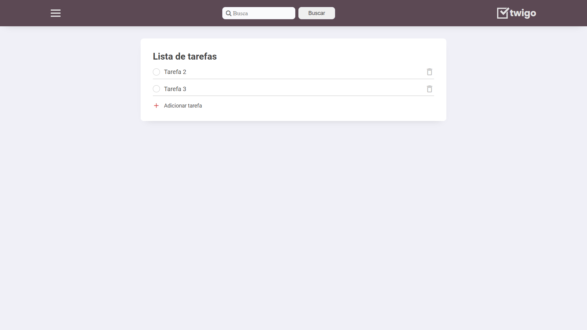
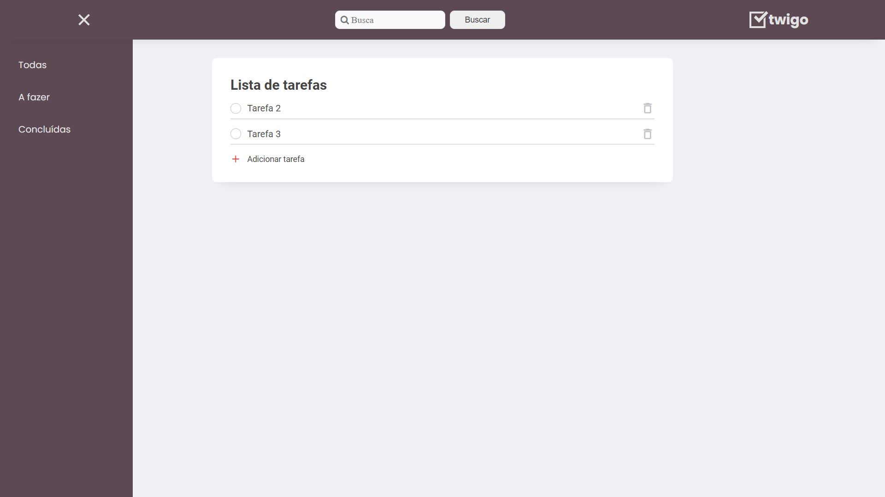
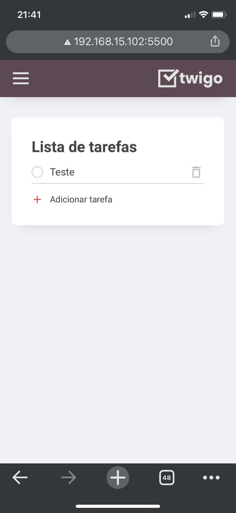

<h1 align="center">
    
</h1>

<p align="center">
  <a href="#page_facing_up-sobre">Sobre</a>&nbsp;&nbsp;&nbsp;|&nbsp;&nbsp;&nbsp;
  <a href="#computer-web">Web</a>&nbsp;&nbsp;&nbsp;|&nbsp;&nbsp;&nbsp;
  <a href="#iphone-mobile">Mobile</a>&nbsp;&nbsp;&nbsp;|&nbsp;&nbsp;&nbsp;
  <a href="#rocket-tecnologias-utilizadas">Tecnologias Utilizadas</a>&nbsp;&nbsp;&nbsp;|&nbsp;&nbsp;&nbsp;
  <a href="#gear-como-configurar-e-executar">Como configurar e executar</a>&nbsp;&nbsp;&nbsp;|&nbsp;&nbsp;&nbsp;
</p>

<br/>

<h3 align="center">
  
</h3>

<br/>


## :page_facing_up: Sobre

O Twigo é um aplicativo de todo list desenvolvido como projeto para o curso DEVinHouse ministrado pelo SENAI e em parceria com a <a href="https://www.softplan.com.br/">Softplan</a> e <a href="https://www.acate.com.br/">ACATE</a>.

URL de acesso: <a href="https://twigo.mausampaio.com/">https://twigo.mausampaio.com/</a>

<br/>

## :computer: Web

<h3 align="center">
  
</h3>

<br/>

## :iphone: Mobile

<h3 align="center">
  
</h3>

<br/>

## :rocket: Tecnologias Utilizadas

- HTML5
- CSS
- Javascript

<br/>

## :gear: Como configurar e executar

```bash

    # Clonar o repositório
    $ git clone https://github.com/mausampaio/devinhouse.git 'devinhouse'

    # Navegar para o diretório
    $ cd devinhouse/modulo-01/semana-03/trabalho-01/

```
Para executar pode ser utilizado a extensão <a href="https://marketplace.visualstudio.com/items?itemName=ritwickdey.LiveServer">Live Server</a> do Visual Studio Code ou executando diretamente o arquivo index.html.

<br/>

---

<h4 align="center">
  Feito com :purple_heart: by <a href="https://www.linkedin.com/in/mausampaio/" target="_blank">Maurício Sampaio</a>.
</h4>