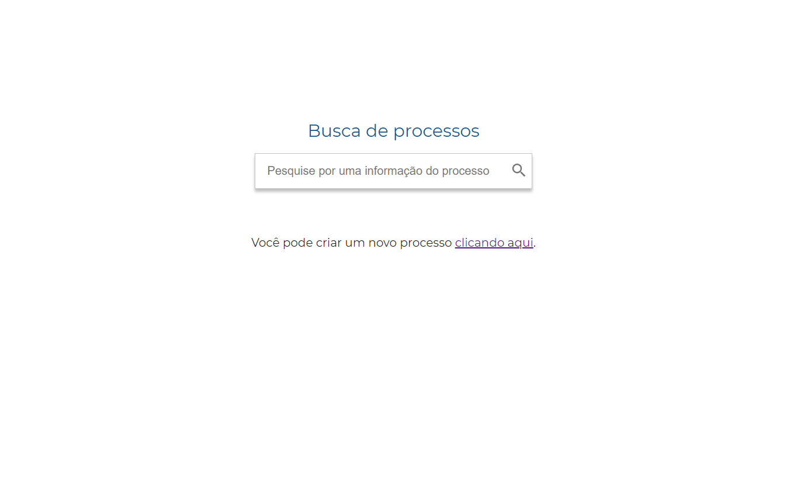
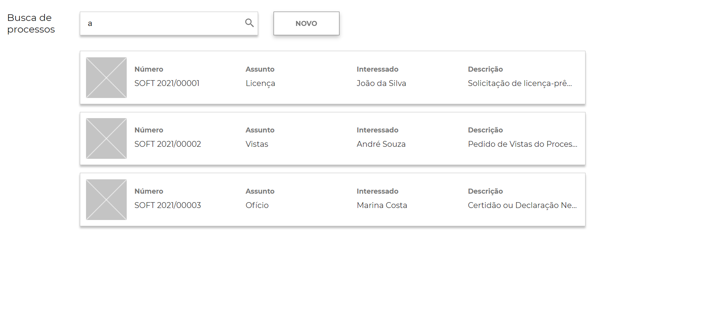
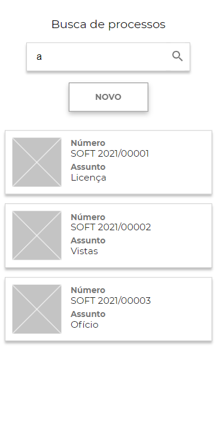

<h1 align="center">
    Busca de processos
</h1>

<p align="center">
  <a href="#page_facing_up-sobre">Sobre</a>&nbsp;&nbsp;&nbsp;|&nbsp;&nbsp;&nbsp;
  <a href="#computer-web">Web</a>&nbsp;&nbsp;&nbsp;|&nbsp;&nbsp;&nbsp;
  <a href="#iphone-mobile">Mobile</a>&nbsp;&nbsp;&nbsp;|&nbsp;&nbsp;&nbsp;
  <a href="#rocket-tecnologias-utilizadas">Tecnologias Utilizadas</a>&nbsp;&nbsp;&nbsp;|&nbsp;&nbsp;&nbsp;
  <a href="#gear-como-configurar-e-executar">Como configurar e executar</a>&nbsp;&nbsp;&nbsp;|&nbsp;&nbsp;&nbsp;
</p>

<br/>

<h3 align="center">
  
</h3>

<br/>


## :page_facing_up: Sobre

Aplicativo desenvolvido como projeto para o curso DEVinHouse ministrado pelo SENAI e em parceria com a <a href="https://www.softplan.com.br/">Softplan</a> e <a href="https://www.acate.com.br/">ACATE</a>. 

Para maiores informações sobre os requisitos veja em <a href="https://github.com/g-cpa-squad-produto/softplan-desafio-frontend">softplan-desafio-frontend</a>.

<br/>

## :computer: Web

<h3 align="center">
  
</h3>

<br/>

## :iphone: Mobile

<h3 align="center">
  
</h3>

<br/>

## :rocket: Tecnologias Utilizadas

- React
- Node
- CSS
- Javascript

<br/>

## :gear: Como configurar e executar

```bash

    # Clonar o repositório
    $ git clone https://github.com/mausampaio/devinhouse.git 'devinhouse'

    # Navegar para o diretório
    $ cd devinhouse/modulo-01/semana-06-07/busca-processos/

```

### Utilizando o Docker

```bash

    # Para subir o ambiente de desenvolvimento
    $ docker-compose -f docker-compose-dev.yml up -d

    # Para subir o ambiente de produção
    $ docker-compose up -d

```

### Sem o Docker

```bash

    $ npm install
    # ou
    $ yarn

    # Para iniciar a aplicação
    $ npm start
    # ou
    $ yarn start

```

<br/>

---

<h4 align="center">
  Feito com :purple_heart: by <a href="https://www.linkedin.com/in/mausampaio/" target="_blank">Maurício Sampaio</a>.
</h4>